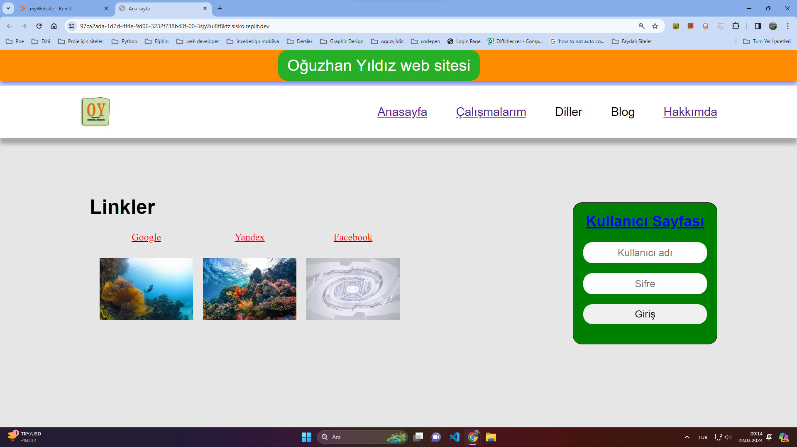
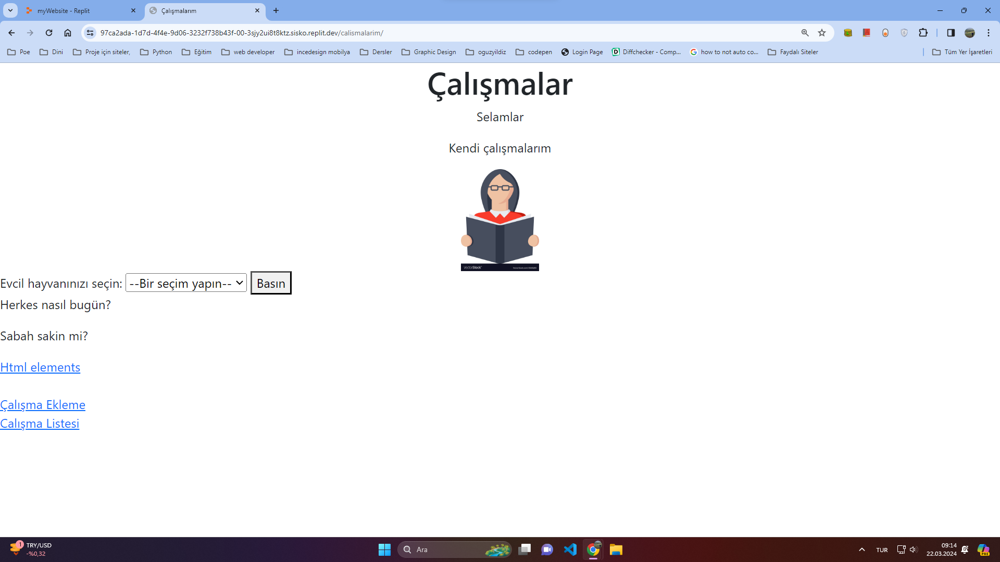
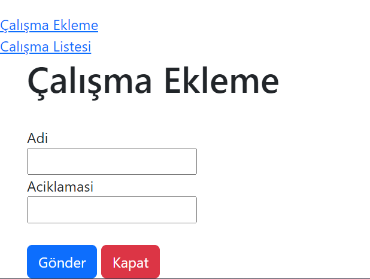
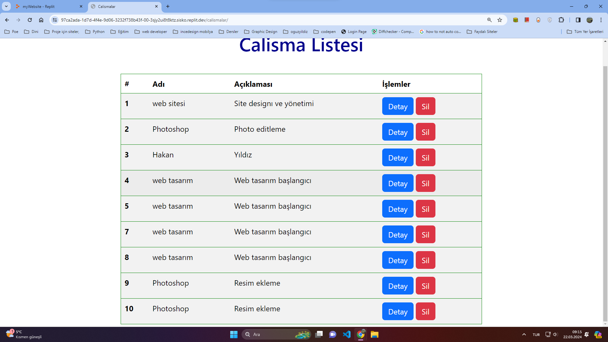
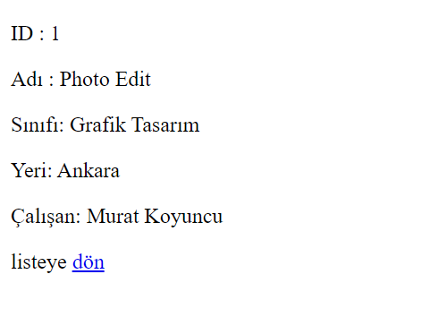
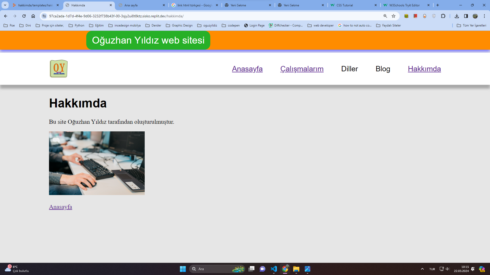

<h1>Vektörel bilişim 4. projesi</h1>

Projenin amacı: Tasarladığımız web sitesini <strong> Django </strong> kullanarak oluşturmak.

<strong>Link:</strong> <a href="https://97ca2ada-1d7d-4f4e-9d06-3232f738b43f-00-3sjy2ui8t8ktz.sisko.replit.dev/">Replit</a>

<h2>Bölümler</h2>
<h3>Anasayfa</h3>

<strong>Anasayfanın</strong> üstünde <i>logo</i> ve site içeriğine yönlendiren menu çubuğu bulunmaktadır. Anasayfanın gövde kısmında ise diğer sitelere yönlendiren <i>linkler</i> bulunmaktadır. 

<h3>Çalışmalarım Sayfası</h3>

<strong>Çalışmalarım</strong> sayfasından veri tabanına çalışma ekleyebilir veya eklediğiniz çalışmaları görünteleyebilirsiniz.

<h4>Çalışma Ekleme</h4>

Çalışmalarım sayfasından <i>çalışma ekleme</i> linkine tıklayarak çalışmanız ile ilgili kayıtları veri tabanına kaydedebilirsiniz.

<h3>Çalışma Listesi Sayfası</h3>

Eklediğiniz çalışmaları bu sayfadan görebilir, çalışma kayıtlarının detaylarına detay düğmesine basarak ulaşabiliriniz. 

<h3>Detay Sayfası</h3>

Bu sayfada çalışma tablosundaki kayıtların detaylarını görebilirsiniz.

<h3>Hakkımda Sayfası</h3>

Oğuzhan Yıldız hakkındaki bilgileri içerir
